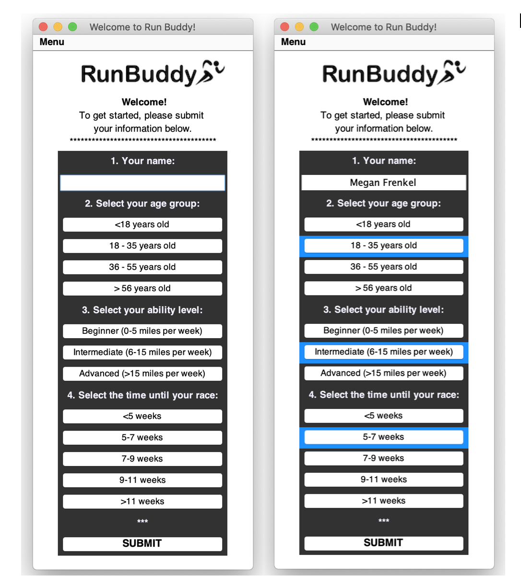
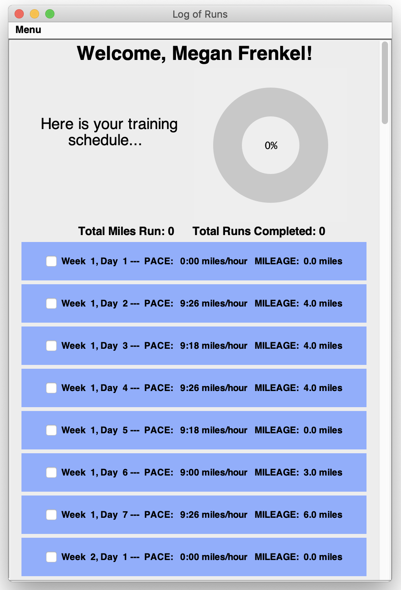
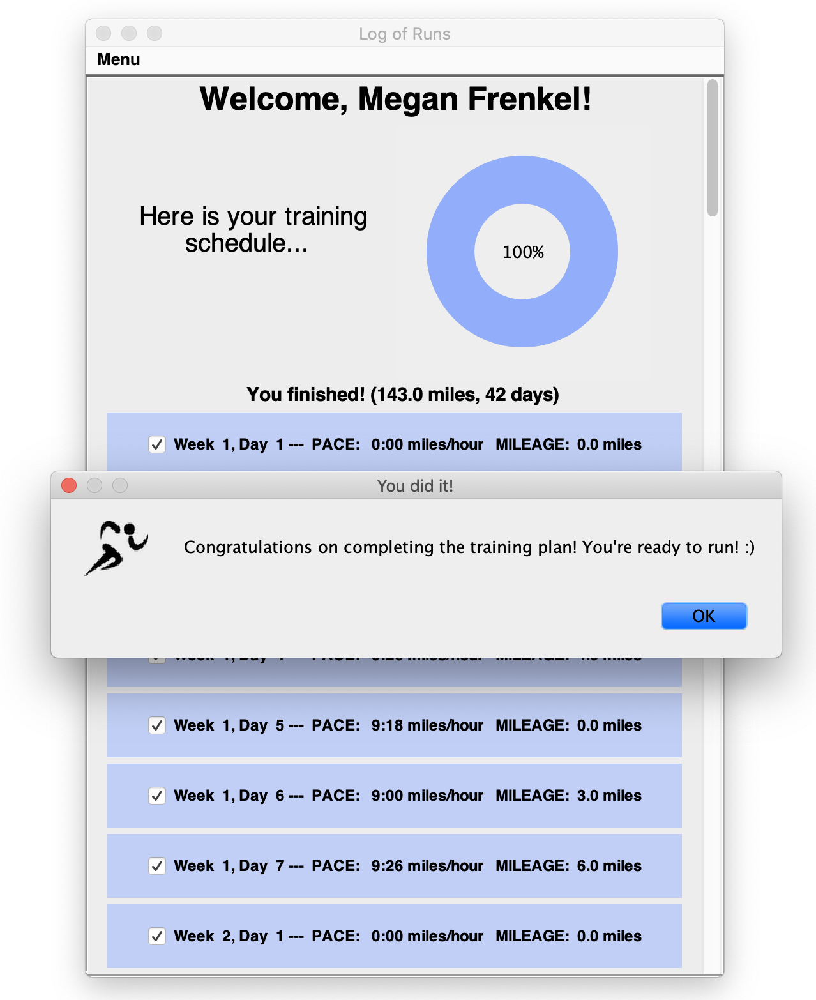

# RunBuddy

## 1.    What is this tool?
RunBuddy is a simple java swing application designed to create half-marathon training plans specific for a given user, based on their age, ability level, and available training time. The program allow users to log and update each of their runs so that their training stays on track!

## 2.    How does a User interact with RunBuddy?

### 2.1 Welcome  UI

When RunBuddy is initially launched, the user is prompted to setup a new user by submitting four pieces of information: 
*  name
*  age group
*  ability level 
*  time until the half marathon. 

The user can type in their name, but must click on the different buttons to select their option for the other categories. When they select an option, it will highlight in blue (see Figure below). These settings will help to tailor the training plan to a user’s unique characteristics.

  

To continue to their training plan, a user must press the SUBMIT button at the bottom of the application. Note that as a user attempts to submit their profile, Running Buddy will not allow either: (1) incomplete submissions, where none of the options have been selected for a given category, or (2) a training time frame <5 weeks in length, as this is too short tof a training period.

Once the submission is accepted, the user’s profile will be saved locally in a .txt file. This means that if a user launches the Running Buddy program in the future, they can select their existing user profile to generate their training plan.

### 2.1 Training Plan UI

With the user information submitted the training plan will be generated behind-the scenes and saved as a .txt file that a user can reference. Immediately afterwards, a user will see a new UI frame that shows an empty progress bar and each of the designated workouts, day by day, until their half marathon race (See Figure below). Each run has a check box associated with it, which a user can click to designate that they have finished the run. When a run is clicked, it fades slightly to designate that it is complete.

  

As runs are completed, the progress bar at the top of the frame and the fields displaying the total miles run and number of runs finished will be updated to allow a user to see their total progress toward their goal.If a user accidentally denotes a run as “done”, they can simply uncheck the box to correct the error.

  

When the user has successfully completed all runs (i.e., all check boxes are marked), Running Buddy will alert the user that their training is complete (See Figur 3)! At that point, their work is done and they can start a new plan over again.

   

